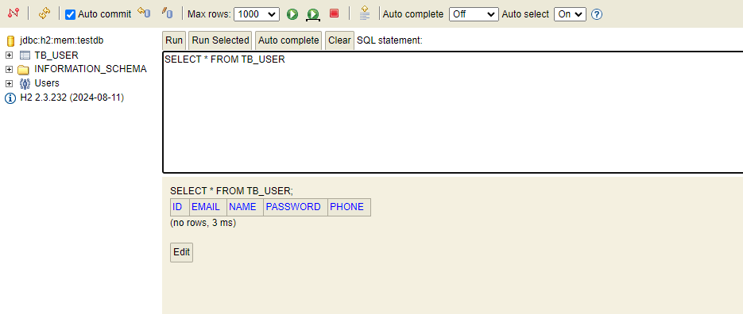
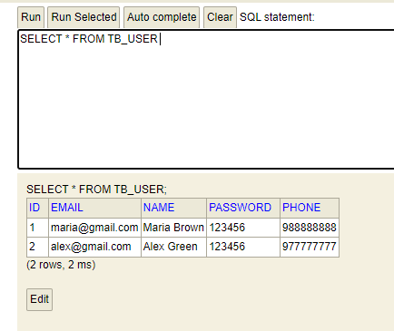
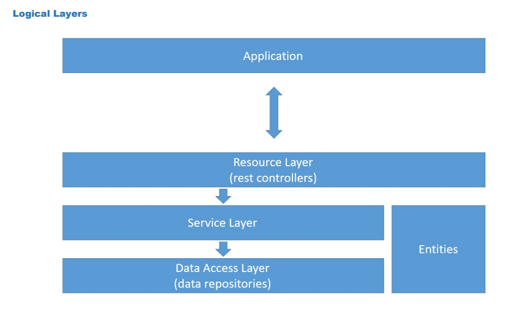
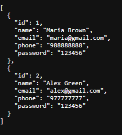
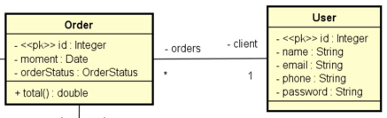

# Spring Boot - Projeto Spring Boot

## Introdução

Nesse primeiro projeto spring iremos aprender a utilizar o Spring Boot para fazer o desenvolvimento de uma aplicação Spring com as seguintes tecnologias:

- Spring Boot
- Spring Data JPA
- Spring Web
- H2
- PostgreSQL

O conteúdo deste projeto foi retirado do curso `Java COMPLETO Programação Orientada a Objetos + Projetos`
 do _Nélio Alves_ na [Udemy](https://www.udemy.com/course/java-curso-completo/).
 
A escrita desse documento foi feita por [Lucas Bonny](https://github.com/lucasbonny) para futuras consultas, e esse projeto está de acordo com o material disponibilizado pelo professor.

## Criação do projeto com Spring Boot

Para a criação do projeto iremos utilizar o [Spring Initializr](https://start.spring.io/) que irá nos ajudar a criar o projeto de forma simples.

### Projeto

- Maven
- Java 17

### Dependências Iniciais

- Spring Web

Vamos seguir um modelo de domínio, onde iremos criar um recurso web para acessar os domínios e um banco de dados para manter a persistência dos dados.

## Criação de um modelo de domínio

Iremos criar a entidade para respeitar o fluxo do modelo na arquitetura do projeto.

- Entidade do domínio
- Repository
- Service
- Resource


### Implementação da entidade

Para a implementação da entidade iremos criar um pacote chamado `entity`, e dentro dele iremos criar uma classe chamada `User` e com isso podemos começar a fazer a implementação do domínio.

#### Modelo seguido na criação da entidade:

- Atributos
- Associações
- Construtores
- Getters and Setters
- Equals and HashCode
- Serializable

```java
public class User implements Serializable {

    private Long id;
    private String name;
    private String email;
    private String password;
    private String phone;

    public User() {
    }

    public User(Long id, String name, String email, String phone, String password) {
        this.id = id;
        this.name = name;
        this.email = email;
        this.phone = phone;
        this.password = password;
    }
    // getters and setters

    // equals and hashCode
}
```

### Implementação do Resource

Para a implementação testar a entidade iremos criar um pacote chamado `resource`, e dentro dele iremos criar uma classe chamada `UserResource` e com isso podemos começar a fazer a implementação do recurso web.

#### Modelo seguido na criação do recurso web:

- Anotação RestController
- Anotação RequestMapping
- Classe Resource

```java
@RestController
@RequestMapping(value = "/users")
public class UserResource {
    //criação de recuro web para acessar os usuários
    @GetMapping
    public ResponseEntity<User> findAll() {
        User user = new User(1L, "Lucas", "lucas@lucasbonny", "61966997755", "123456");
        return ResponseEntity.ok().body(user);
    }

}
```
#### Resposta da requisição GET
```json
{
  "id": 1,
  "name": "Lucas",
  "email": "lucas@lucasbonny",
  "phone": "61966997755",
  "password": "123456"
}
```

## Implementação do banco de dados H2

### Instalando o banco de dados H2

O banco de dados H2 será utilizado para fazer testes na aplicação Spring com salvamento em memória para facilitar o desenvolvimento.

#### Dependências que serão utilizadas
```xml
<!-- Ferramenta de mapeamento ORM -->
<dependency>
    <groupId>org.springframework.boot</groupId>
    <artifactId>spring-boot-starter-data-jpa</artifactId>
</dependency>

<!-- Driver do banco de dados H2 -->
<dependency>
    <groupId>com.h2database</groupId>
    <artifactId>h2</artifactId>
    <scope>runtime</scope>
</dependency>
```

### Configurando um perfil de testes no projeto

Agora iremos ao diretório `src/main/resource/application.properties` e iremos adicionar a seguinte configuração:

```properties
# Definindo o perfil de desenvolvimento
spring.profiles.active=test 
spring.jpa.open-in-view=true
```
Iremos criar o arquivo `application-test.properties` na mesma pasta e iremos adicionar a seguinte configuração:

```properties
# DATASOURCE
spring.datasource.driverClassName=org.h2.Driver
spring.datasource.url=jdbc:h2:mem:testdb
spring.datasource.username=sa
spring.datasource.password=
# H2 CLIENT
spring.h2.console.enabled=true
spring.h2.console.path=/h2-console
# JPA, SQL
spring.jpa.database-platform=org.hibernate.dialect.H2Dialect
spring.jpa.defer-datasource-initialization=true
spring.jpa.show-sql=true
spring.jpa.properties.hibernate.format_sql=true

```
### Mapeamento da entidade para o banco de dados

Agora iremos mapear a entidade User para instruir o JPA de como ele vai converter os objetos para o modelo relacional, e como fazemos isso? Iremos entrar na entidade User e iremos adicionar as seguintes anotações:

```java
@Entity 
@Table(name = "tb_user") // NOME DA TABELA
public class User implements Serializable {
    @Id // PRIMARY KEY
    @GeneratedValue(strategy = GenerationType.IDENTITY) // AUTO_INCREMENT
    private Long id;
    private String name;
    private String email;
    private String phone;
    private String password;
    // ...
}
```
Precisamos alterar o nome da tabela pois o nome `User` é um termo reservado do banco de dados, então iremos alterar para `tb_user`.

Agora iremos verificar se o banco de dados foi criado com sucesso, para isso iremos acessar o link `http://localhost:8080/h2-console` e entrar com o nome de `sa` e a senha vazia.

Ao entrar iremos ver a seguinte tela:



Implementação do banco de dados H2 foi concluida com sucesso!

## Implementação do UserRepository

Iremos criar um pacote chamado `repositories` e dentro dele iremos criar uma interface chamada `UserRepository` e com isso podemos começar a fazer a implementação.

```java
//JpaRepository<Tipo da entidade, Tipo do ID>
public interface UserRepository extends JpaRepository<User, Long> {

}
```

> [!TIP]
> Na classe `UserRepository` se torna opcional o uso da anotação `@Repository` pois ele estende a interface `JpaRepository` que já está registrado como um componente do Spring.

## Implementação da classe de configuração de testes

Iremos criar um pacote chamado `config` e dentro dele iremos criar uma classe chamada `TestConfig` e com isso podemos começar a semear o banco de dados.

> [!IMPORTANT]
> Para semear o banco de dados iremos utilizar o `CommandLineRunner` que irá executar o código ao iniciar o projeto.

```java
@Configuration
@Profile("test")
public class TestConfig implements CommandLineRunner {

    @Autowired
    private UserRepository userRepository;

    @Override
    public void run(String... args) throws Exception {

        User u1 = new User(null, "Maria Brown", "maria@gmail.com", "988888888", "123456");
        User u2 = new User(null, "Alex Green", "alex@gmail.com", "977777777", "123456");

        userRepository.saveAll(Arrays.asList(u1, u2));
    }
}
```
### Resultado:




## Implementação do UserService e delegação de responsabilidades

Iremos seguir o fluxo de implementação do `UserService` conforme o diagrama abaixo:



Devemos separar as responsabilidades para facilitar a manutenção do projeto. A classe `UserResource` irá receber as requisções e enviar as respostas para o `UserService`, já o `UserService` é responsável pela regra de negócio, e o `UserRepository` irá fazer o acesso ao banco de dados.

Agora vamos criar um pacote chamado `services` e dentro dele iremos criar uma classe chamada `UserService` e com isso podemos começar a fazer a implementação.

```java
@Service
public class UserService {

    @Autowired
    private UserRepository repository;

    public List<User> findAll() {
        return repository.findAll();
    }

    public User findById(Long id) {
        Optional<User> obj = repository.findById(id);
        return obj.get();
    }
}
```

Agora iremos atualizar a classe `UserResource` para que ele possa retornar os dados do banco de dados para a rota `/users`.

```java
@RestController
@RequestMapping(value = "/users")
public class UserResource {

    @Autowired
    private UserService service;

    @GetMapping
    public ResponseEntity<List<User>> findAll() {
        List<User> list = service.findAll();
        return ResponseEntity.ok().body(list);
    }

    @GetMapping(value = "/{id}")
    public ResponseEntity<User> findById(@PathVariable Long id) {
        User obj = service.findById(id);
        return ResponseEntity.ok().body(obj);
    }
}
```
### Resultado:



> [!IMPORTANT]
> Para que a injeção de dependência funcione devemos registrar a classe `UserService` como um componente do Spring, utilizando a anotação `@Service` ou `@Component`.
> já na classe `UserRepository` se torna opcional pois ele estende a interface `JpaRepository` que já está registrado como um componente do Spring.

## Classe Order



A classe `Order` está associada a classe `User` onde 1 `User` pode ter várias `Order` e 1 `Order` pode ter 1 `User`, então iremos criar uma classe chamada `Order` e fazer a associação.

### Ordem de implementação

- Entity
- "To many" association, lazy loading(Carregamento "Preguiçoso"), JsonIgnore
- Repository
- Seed
- Service
- Resource

> [!TIP]
> As coleções é criado somente o Getter sem o Setter.

```java
@Entity
@Table(name = "tb_order")
public class Order {
    @Id
    @GeneratedValue(strategy = GenerationType.IDENTITY)
    private Long id;
    private Date moment;
    @ManyToOne
    @JoinColumn(name = "client_id")
    private User client;
    public Order() {
    }
    public Order(Long id, Date moment, User client) {
        this.id = id;
        this.moment = moment;
        this.client = client;
    }
    // getters and setters
}
```

> [!TIP] 
> As coleções deverão ser instanciadas com `new ArrayList<>()` para seu uso.

Utilizando a anotação `@ManyToOne`, indicamos que o atributo `client` é uma chave estrangeira da tabela `tb_order`, referenciando a tabela `tb_client`.

```java
//Arquivo: User.java
@OneToMany(mappedBy = "client")
private List<Order> orders = new ArrayList<>();
```

> [!IMPORTANT]
> Ao fazer a associação com o `@ManyToOne`, o banco de dados irá criar uma nova coluna na tabela `tb_order` para armazenar o ID do `User` que está sendo referenciado, mas se caso eu queira saber os pedidos de um determinado `User` precisaremos mapear na classe `User` a referência ao `List<Order> orders` usando o MappedBy informando o nome do atributo `client`.